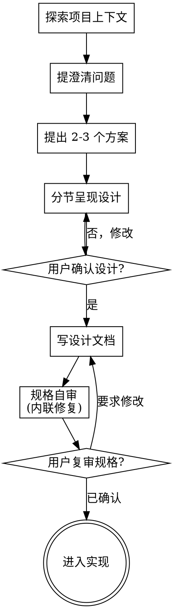

# 把想法头脑风暴成设计

通过自然协作对话，把想法变成完全成型的设计和规格说明。

先理解当前项目上下文，然后逐个提问来打磨想法。一旦清楚要做什么，就呈现设计并获得用户确认。

<硬门控>
在你呈现设计并经用户确认之前，不要调用任何实现技能、写任何代码、搭建任何项目或采取任何实现动作。这适用于每一个项目，无论它看起来多简单。
</硬门控>

## 反模式：「这太简单，不需要设计」

每个项目都要走这个过程。一个待办清单、一个单函数工具、一次配置改动——全都算。「简单」的项目恰恰是未经审视的假设造成最多返工的地方。设计可以很短（真正简单的项目几句话即可），但你必须呈现它并获取确认。

## 检查清单

为以下每一项创建一个任务，并按顺序完成：

1. **探索项目上下文** —— 检查文件、文档、近期提交
2. **即时提供视觉伴侣** —— 不要一开始就提供。第一次某个问题用「展示」比「描述」更清楚时，再在那一步提供（作为独立消息）；用户同意后，浏览器标签页会自动打开。如果从头到尾都没有视觉问题，就永远不提供。见下文「视觉伴侣」一节
3. **提澄清问题** —— 一次一个，理解目的/约束/成功标准
4. **提出 2-3 个方案** —— 带取舍和你的推荐
5. **呈现设计** —— 按复杂度分节，每节后获用户确认
6. **写设计文档** —— 保存到 `docs/specs/YYYY-MM-DD-<主题>-design.md` 并提交
7. **规格自审** —— 快速内联检查占位符、矛盾、歧义、范围（见下文）
8. **用户复审规格** —— 在继续之前请用户复审规格文件
9. **转入实现** —— 呈现已验证的设计与规格，按常规工作流进入实现

## 流程图

**终态是进入实现。** 不要在呈现设计并获确认之前就开始写代码或调用其他实现技能。

## 流程

**理解想法：**

- 先看当前项目状态（文件、文档、近期提交）
- 在问细节问题之前，先评估范围：如果请求描述了多个独立子系统（例如「搭建一个含聊天、文件存储、计费和分析的平台」），立即指出。不要在一个需要先拆分的项目上花问题去打磨细节
- 如果项目对单个规格来说太大，帮用户拆成子项目：独立的部分有哪些、它们如何关联、应按什么顺序构建？然后用正常设计流程头脑风暴第一个子项目。每个子项目走自己的规格 → 计划 → 实现周期
- 对范围合适的项目，一次问一个问题来打磨想法
- 尽可能用多选题，开放式也可以
- 每条消息只问一个问题——某话题需要更多探索时，拆成多个问题
- 聚焦于理解：目的、约束、成功标准

**探索方案：**

- 提出 2-3 个不同方案，带取舍
- 口头呈现选项，附你的推荐和理由
- 以推荐选项开头并解释为什么
- 狠用 YAGNI——从每个方案和设计中砍掉不必要的特性

**呈现设计：**

- 一旦你认为理解了要做什么，就呈现设计
- 按复杂度缩放每节：简单就几句话，微妙就 200-300 字
- 每节后问一句「目前看起来对吗」
- 覆盖：架构、组件、数据流、错误处理、测试
- 准备好回头澄清任何不通的地方

**为隔离与清晰而设计：**

- 把系统拆成更小的单元，每个有单一明确目的，通过定义良好的接口通信，能独立理解和测试
- 对每个单元，你应能回答：它做什么、怎么用、它依赖什么？
- 不读内部实现就能理解一个单元在做什么吗？能改内部而不破坏消费者吗？不能的话，边界还需打磨
- 更小、边界良好的单元也更好让代理工作——上下文能一次装下的代码，代理推理更靠谱，文件聚焦时编辑也更可靠。文件变大往往是它干了太多事的信号

**在既有代码库中工作：**

- 提改动前先探索当前结构，遵循既有模式
- 当既有代码存在问题影响当前工作（如文件过大、边界不清、职责纠缠），把针对性改进作为设计的一部分——就像好的开发者会改善在其中的代码
- 不提无关的重构，保持聚焦于服务当前目标

## 设计之后

**文档：**

- 把验证过的设计（规格）写到 `docs/specs/YYYY-MM-DD-<主题>-design.md`
  - （用户对规格位置的偏好覆盖此默认值）
- 若有可用的写作风格技能，使用它
- 把设计文档提交到 git

**规格自审：**
写完规格文档后，用新鲜眼光审视它：

1. **占位符扫描：** 有没有「待定」「TODO」、不完整的章节或含糊的需求？修掉
2. **内部一致性：** 章节间有矛盾吗？架构和功能描述对得上吗？
3. **范围检查：** 够聚焦于单个实现计划吗，还是需要拆分？
4. **歧义检查：** 任何需求有两种解读吗？有的话，选一种并写明确

内联修掉问题。不需要复审——改完继续即可。

**用户复审门控：**
规格自审循环通过后，请用户复审写好的规格再继续：

> 「规格已写入并提交到 `<路径>`。请复审，在开始写实现计划前告诉我是否要改。」

等用户回复。若要求修改，改完重跑规格自审循环。仅在用户确认后继续。

**实现：**

- 设计与规格完成，按常规工作流进入实现
- 不要在未呈现设计并获确认前开始写代码

## 视觉伴侣

一个基于浏览器的伴侣，用于在头脑风暴中展示 mockup、图表和选项。作为工具而非模式提供。接受伴侣意味着对那些视觉处理收益更大的问题它可用；**不**意味着每个问题都走浏览器。

**即时提供伴侣：** 不要一开始就提供。等到某个问题确实「展示」比「描述」更清楚时——是一个真正的 mockup / 布局 / 图表问题，而不只是个 UI 话题。第一次出现时，作为独立消息提供：

> 「接下来这部分我展示给你可能更清楚——我可以在浏览器标签页里随对话推进，放一些 mockup、图表和对比。它还比较新，可能比较费 token。要我开吗？我会打开。」

**这个提议必须是它自己的独立消息。** 只放提议本身——不放澄清问题、总结或其他内容。等用户回复。若同意，用 `--open` 启动服务器，浏览器会自动打开第一个界面。若拒绝，继续纯文本，除非用户重提否则不再提供。

**逐题决定：** 即便用户接受了伴侣，也要对每个问题独立决定用浏览器还是终端。判断标准：**用户看到它比读到它更好理解吗？**

- **用浏览器** 展示本身就是视觉的内容——mockup、线框图、布局对比、架构图、并排的视觉设计
- **用终端** 处理文本内容——需求问题、概念选择、取舍清单、A/B/C/D 文字选项、范围决策

关于 UI 话题的问题不一定是视觉问题。「这个语境下『个性化』指什么？」是概念问题——用终端。「哪种向导布局更好？」是视觉问题——用浏览器。

若用户同意使用伴侣，继续前请读详细指南：
`${WAVE_SKILL_DIR}/visual-companion.md`
