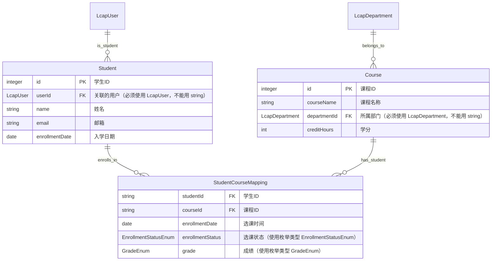
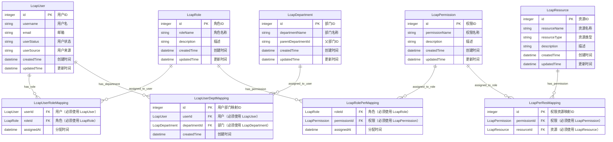

# 数据建模-实体关系总览图

- **生成时间**：[DATE]

<!-- 🚨 【最高优先级 - 所有人员相关属性必须关联到 LcapUser】
任何涉及人员的属性（不仅仅是 userId），都必须使用 LcapUser 实体类型进行 FK 关联。
这不是针对某个特定属性的规则，而是对所有属性的通用规则：如果属性涉及人员，就必须关联到 LcapUser。

❌ 错误示例（禁止 - 用基础类型表示人员）：
  - userId: integer FK "用户ID"
  - assigneeId: int FK "指派人ID"
  - follower: string "跟进人"
  - responsiblePerson: string "负责人"
  - manager: string "经理"

✅ 正确示例（必须 - 所有人员属性都关联到 LcapUser）：
  - userId: LcapUser FK "关联的用户"
  - assigneeId: LcapUser FK "指派人"
  - follower: LcapUser FK "跟进人"
  - responsiblePerson: LcapUser FK "负责人"
  - manager: LcapUser FK "经理"

【关键原则】：
- 任何属性名中包含"人"、"用户"、"创建"、"指派"、"跟进"、"负责"、"经理"等人员相关词汇的属性，都必须关联到 LcapUser
- 不要用 string 或 integer 来存储人员信息，必须通过 FK 关联到 LcapUser 实体
- 这是对所有属性的通用规则，不仅仅是 userId
-->

<!-- 实体：业务领域中具有**唯一身份、独立生命周期和业务语义**的核心对象，用于在系统中结构化地表达现实世界的业务概念，是数据持久化、服务建模与界面交互的基础单元。

【严格禁止项】
❌ 禁止生成任何权限相关实体（权限、角色、权限映射等）
❌ 禁止生成任何用户相关实体（用户、账号、用户信息等）
❌ 禁止生成任何部门相关实体（部门、组织架构、部门关系等）
❌ 禁止生成任何人员相关实体（员工、人员、职员、人员信息、人员档案等）
❌ 禁止生成任何人员角色实体（网格员、经理、主管、负责人等"XXX员"、"XXX人"的实体）
❌ 禁止生成任何与组织架构相关的实体（如部门、组、团队、部门分组、组织单元等组织结构相关的实体）
❌ 禁止生成任何与组织架构相关的人员实体
❌ 禁止生成任何与当前组织架构相关的人员信息实体
❌ 禁止生成任何菜单相关实体（菜单、导航、功能菜单等）
✅ 所有权限、用户、部门、人员、账号、组织架构相关功能必须使用内置的权限中心（PermissionCenter）提供的实体（LcapUser、LcapDepartment、LcapRole、LcapPermission 等）
✅ 如需表示人员的特定角色或职责，通过权限中心的角色机制或直接关联 LcapUser

禁止遗漏 应用架构-核心领域划分 文档中每个子域的任何核心实体 -->

<!-- ⚠️ 【强制约束】实体关联关系规范：
1. 【禁止创建人员相关实体和人员角色实体】禁止生成任何人员相关的实体（如员工、职员、人员、人员信息等），禁止生成任何人员角色实体（如网格员、经理、主管、负责人等"XXX员"、"XXX人"的实体），禁止生成任何与组织架构相关的实体（如部门、组、团队、部门分组、组织单元等组织结构相关的实体），禁止生成任何与组织架构相关的人员实体。所有人员和组织架构信息必须通过 FK 关联到 LcapUser 和 LcapDepartment 实体。
   - ❌ 错误：创建 Employee、Staff、Person、Personnel、GridManager、Manager、Supervisor、OrganizationGroup、Team、Department 等人员、人员角色或组织结构实体
   - ✅ 正确：所有人员和组织架构相关属性都关联到 LcapUser 或 LcapDepartment FK，如需表示人员角色通过权限中心的角色机制

2. 【所有人员属性必须关联到 LcapUser】任何涉及人员的属性都必须通过 FK 关联到 LcapUser 实体，禁止用 string/int 等基础类型存储人员信息。
   - 包括但不限于：userId、assigneeId、follower、responsiblePerson、manager、operator、approver、gridManager 等
   - ⚠️ 特殊情况【审计属性例外】：createdBy 和 updatedBy 这类审计属性必须使用 string 类型存储用户ID或用户名，不能使用 FK 关联到 LcapUser
     * ❌ 错误：createdBy: LcapUser FK "创建人"、updatedBy: LcapUser FK "更新人"
     * ✅ 正确：createdBy: string "创建人"、updatedBy: string "更新人"
   - 其他人员属性示例：
     * ❌ 错误：assigneeId: integer FK "指派人"、gridManager: string "网格员"
     * ✅ 正确：assigneeId: LcapUser FK "指派人"、gridManager: LcapUser FK "网格员"

3. 【组织架构类属性的判定顺序】任何涉及部门、组织单元等组织架构属性时，必须先检查“应用架构-核心领域划分”或当前业务设计中是否已经存在对应的业务实体；如果已经存在业务实体（如厂区 FactoryArea、园区 Park、仓库 Warehouse、门店 Store、项目组 ProjectGroup 等），必须优先关联该业务实体；只有在确实不存在可用业务实体、且该属性表达的就是通用组织架构时，才允许关联到 LcapDepartment。禁止为了复用内置实体而把明显属于业务领域的实体错误映射到 LcapDepartment。
   - ❌ 错误：核心领域里已经有 FactoryArea，却把 `factoryAreaId` 关联到 LcapDepartment
   - ✅ 正确：`factoryAreaId: FactoryArea FK "厂区"`
   - ✅ 正确：只有真正表达“所属部门/责任部门/审批部门”等通用组织架构含义时，才使用 `departmentId: LcapDepartment FK "所属部门"`

4. 【所有实体关联必须使用 FK】任何涉及其他实体的属性都必须通过 FK 建立显式的实体关联，禁止用 ID 字符串或数字表示。
   - ❌ 错误：customerId: string "客户ID"、departmentId: integer "部门ID"
   - ✅ 正确：customerId: Customer FK "关联的客户"、departmentId: LcapDepartment FK "所属部门"

5. 【强制使用内置实体】以下实体必须直接使用，禁止自定义替代品：
   - 人员信息：必须使用 LcapUser 实体，禁止创建 User、Employee、Staff、Person、Personnel 等自定义实体
   - 人员角色：必须使用权限中心的角色机制或直接关联 LcapUser，禁止创建 GridManager、Manager、Supervisor 等人员角色实体
   - 组织架构：如果业务设计里没有对应的业务实体，必须使用 LcapDepartment 实体，禁止创建 Department、Org、Team、OrganizationGroup、Group 等通用组织结构实体；但若核心领域已定义了明确业务实体（如厂区、园区、仓库、门店等），则优先使用这些业务实体
   - 组织架构相关人员信息：必须使用 LcapUser 和 LcapDepartment 实体，禁止创建任何与当前组织架构相关的人员信息实体
   - 角色权限：必须使用 LcapRole 和 LcapPermission 实体，禁止创建 Role、Permission、Authority 等自定义实体
   - 如果业务需要关联人员、部门、角色权限，直接通过 FK 关联这些内置实体，不要创建新实体
-->

<!-- 实体属性必须使用已经生成的实体和枚举。⚠️ 严禁用 string、int、float 等基础类型替代枚举——如果 数据建模-枚举（[项目设计目录对应路径]/data-model/enums.md） 文件中已定义了某个枚举，该属性的类型必须是该枚举名称而不是 string 或数字。检查清单：(1) 扫描所有属性，对标数据建模-枚举文件；(2) 如果属性值是有限、离散、固定的业务值，必须使用对应的枚举类型；(3) 禁止用 string 或数字直接表示应该用枚举的属性（如状态、类型、分类等）；(4) 确保属性类型与枚举文件完全一致。 -->
<!-- 实体英文名称严格使用 PascalCase 格式 -->

<!-- Mermaid ER 图语法规范：-->
<!-- 1. 使用 erDiagram 作为图表类型，所有关系定义必须在实体定义之前 -->
<!-- 2. 实体名称使用 PascalCase，属性名使用 camelCase，只能包含英文字母、数字 -->
<!-- 3. 关系定义格式：Entity1 ||--o{ Entity2 : "relationship_name"，其中 || 表示一对一，o{ 表示零到多，关系名必须用双引号包裹 -->
<!-- 4. 属性定义格式：type attributeName [PK|FK] "中文描述"
   - 基础类型：string、int、float、date、datetime、boolean、text、decimal
   - 枚举类型：任何已定义的枚举类型名称（如 UserStatusEnum、OrderTypeEnum 等）
   - 实体关联类型：任何其他实体名称（如 LcapUser、Customer、Opportunity 等）
    
    【强制规则】：
    - 所有实体的主键只能写成 `integer id PK "..."` 这一类形式：主键字段名必须是 `id`，主键类型必须是 `integer`；主键中文描述可以按业务语义自由填写，不强制限定具体文案
    - 禁止把主键写成 `string supplyId PK "用品编号"`、`string studentId PK "学号"`、`integer orderId PK "订单ID"` 等非 `id` 命名或字符串主键形式
    - 所有 FK 关联属性的类型必须是关联的实体名称，而不是基础类型
    - 所有人员相关属性（包含"人"、"用户"、"创建"、"指派"、"跟进"、"负责"等词汇）必须关联到 LcapUser
    - ⚠️ 特殊情况【审计属性例外】：createdBy 和 updatedBy 这类审计属性必须使用 string 类型，不能使用 FK 关联
    - 所有其他实体关联属性必须使用对应的实体名称
   
   ❌ 禁止示例：
     * userId: integer FK、assigneeId: int FK
     * customerId: string FK、departmentId: integer FK
     * createdBy: LcapUser FK、updatedBy: LcapUser FK（审计属性禁止使用 FK）
   
   ✅ 必须示例：
     * userId: LcapUser FK、assigneeId: LcapUser FK
     * customerId: Customer FK、departmentId: LcapDepartment FK、factoryAreaId: FactoryArea FK
     * createdBy: string "创建人"、updatedBy: string "更新人"（审计属性必须使用 string）
   
   - 如果属性对应的枚举已在数据建模-枚举文件中定义，必须直接使用枚举类型名称而不是 string。 -->
<!-- 6. 禁止在属性描述中使用特殊符号（|、/、\、"、'、<、>），禁止使用中文属性名，禁止直接连接业务实体进行多对多关系，禁止在关系名称中使用特殊符号或中文，禁止遗漏主键定义，禁止重复定义同一个实体 -->
<!-- 7. 【强制关联检查】生成后必须检查：
    - 所有实体名称都是 PascalCase、所有属性名都是 camelCase
    - 每个实体都有且仅有一个 PK，且该 PK 必须是 `integer id PK "..."` 形式
    - 所有关系都在实体定义之前
    - 关系名称和属性描述都用双引号包裹且不含特殊符号
    - 没有重复的实体定义、没有语法错误
   - **所有可枚举的属性都使用了对应的枚举类型而不是 string/int/float**
   - ⚠️ 【关键检查】扫描所有属性，确保：
     * 没有创建任何人员相关的实体（Employee、Staff、Person、Personnel 等）
     * 没有创建任何人员角色实体（GridManager、Manager、Supervisor 等"XXX员"、"XXX人"的实体）
     * 没有创建任何与组织架构相关的实体（OrganizationGroup、Team、Department、Group 等组织结构实体）
     * 没有创建任何与组织架构相关的人员实体
     * 所有人员相关属性（userId、assigneeId、follower、responsiblePerson、manager、operator、approver、gridManager 等）都关联到 LcapUser，禁止用 string/int 表示
     * ⚠️ 审计属性特殊处理：createdBy 和 updatedBy 必须使用 string 类型，不能使用 FK 关联到 LcapUser
      * 所有组织架构相关属性都先检查是否已有对应业务实体；如果已有（如 FactoryArea、Park、Warehouse、Store 等）必须优先关联业务实体，只有真正的通用部门/组织单元才关联到 LcapDepartment
     * 所有与当前组织架构相关的人员信息属性都关联到 LcapUser 和 LcapDepartment，禁止创建独立的人员信息实体
     * 所有其他实体关联属性都使用对应的实体名称，禁止用 string/int 表示 ID
     * 没有出现 userId: string、creatorId: string、assigneeId: integer 等基础类型的人员字段
     * 没有出现 customerId: string、departmentId: integer、groupId: string 等基础类型的实体关联字段
     * 没有出现 createdBy: LcapUser FK、updatedBy: LcapUser FK 这样的错误审计属性定义
      * 只有真正的部门相关属性才关联到 LcapDepartment；像厂区、园区、仓库、门店等若已在核心领域中定义实体，必须关联这些业务实体
     * 所有角色权限相关的属性都关联到 LcapRole 或 LcapPermission
     * 业务实体间的关联关系完整，能够表达完整的业务管理层级和流程
-->
<!-- 8. 【枚举类型识别和替换】生成 ER 图时，必须执行以下步骤：(1) 读取数据建模-枚举文件，获取所有已定义的枚举及其名称；(2) 扫描所有实体属性，识别哪些属性应该使用枚举类型；(3) 对于每个应该使用枚举的属性，直接用枚举类型名称替代 string/int/float（如：status: UserStatusEnum 而不是 status: string）；(4) 确保 ER 图中的枚举类型名称与枚举文件中的定义完全一致；(5) 严禁遗漏任何可枚举的属性。 -->

[严格遵守 `mermaid` 格式，基于实体映射关系生成 ER 图。必须通过实体的关联关系，避免出现多实体之间有大量重复的实体属性。

【最关键的强制规则 - 所有属性都可能是关联属性】：
1. 【所有人员属性必须关联到 LcapUser】不仅仅是 userId，任何涉及人员的属性都必须关联到 LcapUser
   - 包括：assigneeId、follower、responsiblePerson、manager、operator、approver、reviewer、handler 等
   - ⚠️ 特殊情况【审计属性例外】：createdBy 和 updatedBy 这类审计属性必须使用 string 类型，不能使用 FK 关联
   - 禁止用 string/int 存储人员信息，必须使用 LcapUser FK（审计属性除外）

2. 【组织架构属性优先匹配业务实体】任何涉及部门、组织单元、厂区、园区、仓库、门店、项目组等层级结构属性时，必须先匹配核心领域中已存在的业务实体；若已有对应实体，必须优先关联该业务实体；只有当该属性确实表达的是通用组织架构、且业务领域中没有对应实体时，才关联到 LcapDepartment。
   - 包括：departmentId、groupId、organizationId、teamId，以及 factoryAreaId、parkId、warehouseId、storeId 等
   - ❌ 错误：核心领域已存在 `FactoryArea`，却写成 `factoryAreaId: LcapDepartment FK "厂区"`
   - ✅ 正确：`factoryAreaId: FactoryArea FK "厂区"`
   - ✅ 正确：`departmentId: LcapDepartment FK "所属部门"`（仅当表达真实部门语义时）

3. 【所有实体关联属性必须使用实体类型】任何涉及其他实体的属性都必须使用对应的实体名称，禁止使用 integer/string/float
   - 包括：customerId、opportunityId、taskId、orderId 等
   - 禁止用 string/int 存储实体 ID，必须使用对应实体的 FK

4. 【这是对所有属性的通用规则】不要仅仅关注特定属性名，要理解：
   - 如果属性涉及人员 → 关联到 LcapUser（审计属性 createdBy、updatedBy 除外）
    - 如果属性涉及组织架构或业务层级结构 → 先关联核心领域中已定义的业务实体；只有没有对应业务实体且确属通用部门语义时，才关联到 LcapDepartment
   - 如果属性涉及其他实体 → 关联到对应实体
   - 如果属性涉及枚举值 → 使用对应枚举类型
   - 禁止用基础类型（string/int/float）来表示任何关联关系（审计属性除外）
]

<!-- 以下为 ER 图的参考示例，特别注意枚举类型的正确应用，以及内置实体（LcapUser、LcapDepartment、LcapRole、LcapPermission）的强制使用：

【示例 1：正确的实体关联（使用 FK 而不是 ID 字符串）】

【示例 2：权限角色的正确使用】

⚠️ 【关键要点】：
1. ❌ 错误做法：创建 Employee、Staff、Person、Personnel、GridManager、Manager、Supervisor、OrganizationGroup、Team、Department 等人员、人员角色或组织结构实体；userId: string "用户ID"、departmentId: string "部门ID"、groupId: string "组"、roleId: string "角色ID"、gridManager: string "网格员"；createdBy: LcapUser FK "创建人"、updatedBy: LcapUser FK "更新人"
2. ✅ 正确做法：禁止创建人员实体、人员角色实体和组织结构实体，所有人员和组织架构属性都关联到 LcapUser 或 LcapDepartment；userId: LcapUser FK "关联的用户"、departmentId: LcapDepartment FK "所属部门"、groupId: LcapDepartment FK "所属组"、roleId: LcapRole FK "分配的角色"、gridManager: LcapUser FK "网格员"；createdBy: string "创建人"、updatedBy: string "更新人"
3. 禁止创建 User、Employee、Department、Role、Permission、OrganizationGroup、Team 等自定义实体，必须直接使用内置实体
4. 禁止创建任何人员角色实体（如网格员、经理、主管等），如需表示人员的特定角色或职责，通过权限中心的角色机制或直接关联 LcapUser
5. 禁止创建任何与组织架构相关的实体（如部门、组、团队、部门分组、组织单元等），所有组织架构相关属性必须关联到 LcapDepartment
6. 禁止创建任何与组织架构相关的人员实体，禁止创建任何与当前组织架构相关的人员信息实体，所有人员信息必须通过 LcapUser 和 LcapDepartment 关联
7. ⚠️ 审计属性特殊处理：createdBy 和 updatedBy 这类审计属性必须使用 string 类型存储用户ID或用户名，不能使用 FK 关联到 LcapUser
8. 所有人员、部门、角色权限的关联都必须通过 FK 显式建立，而不是用 ID 字符串表示（审计属性除外）
-->
